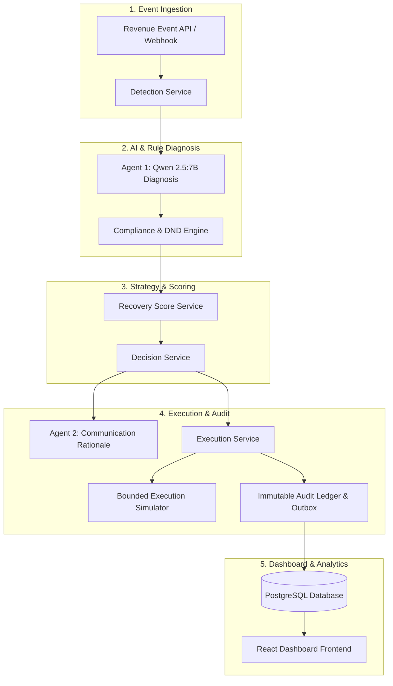

# Nirnay Pay (RecoveryOS)

**AI Revenue Loss Recovery Engine for Razorpay AI Buildathon — Track 03**

Nirnay Pay (RecoveryOS) is an authoritative, financial-first revenue loss detection and recovery orchestration platform. It detects, diagnoses, governs, and executes recovery workflows across payment failures, checkout abandonments, subscription drop-offs, and overdue corporate receivables.

Built on an **explicit finite state machine**, **deterministic financial authority**, **dual AI agent architecture**, and **single-paise database reconciliation**, Nirnay Pay guarantees zero prompt-injection financial overrides, zero double charges, and full auditability.

---

## Key Features

* **Multi-Scenario Ingestion**: Automated detection across `PAYMENT_FAILURE`, `CHECKOUT_ABANDONMENT`, `SUBSCRIPTION_FAILURE`, and `OVERDUE_RECEIVABLE`.
* **2-Agent AI Architecture**:
  * **Agent 1 (`nirnay_revenue_diagnosis_agent`)**: Local Qwen 2.5:7B diagnosis agent categorizing root causes (e.g. `INSUFFICIENT_FUNDS`, `EXPIRED_CARD`, `DND_OPT_OUT`).
  * **Agent 2 (`nirnay_recovery_communication_agent`)**: Customer communication rationale generator (Qwen 2.5 / Grok API fallback).
* **Deterministic Financial Authority**: LLMs recommend actions; deterministic rules (`ComplianceChecker`, `StoppingRules`, `RecoveryRightsService`) enforce attempt limits, DND policies, and state machine transitions.
* **Bounded Execution Simulation**: `BoundedExecutionSimulator` models payment gateway responses, customer interactions, and retry timing causally without live card charges.
* **Single-Paise Financial Reconciliation**: Integer-paise database storage with independent SQL raw oracle verification (`Oracle == Batch API == Ledger`).
* **Exactly-Once Execution & Idempotency**: Atomic PostgreSQL `FOR UPDATE` row locking and idempotency key checks prevent duplicate execution.
* **Real-Time Merchant Dashboard**: Modern React + Vite + TypeScript interface for monitoring recovery rate, revenue at risk, active cases, and audit trails.

---

## System Architecture



---

## Technology Stack

| Layer | Technology |
| :--- | :--- |
| **Frontend Dashboard** | React 19, Vite 8, TypeScript, Tailwind CSS, TanStack Router/Query, Recharts |
| **Backend API** | Python 3.11, FastAPI, Uvicorn, Pydantic v2, SQLAlchemy 2.0 |
| **Database** | PostgreSQL / Supabase, SQLite (Local Dev fallback) |
| **AI / LLM Layer** | Ollama (Local Qwen 2.5:7B model), xAI Grok API (fallback) |
| **State Engine** | Explicit Finite State Machine (`RecoveryStateMachine`) |
| **Observability & Ops** | Prometheus Metrics (`/api/v1/metrics`), Outbox Worker, Emergency Kill Switch |

---

## Project Structure

```text
Nirnay Pay/
├── backend/
│   ├── app/
│   │   ├── api/             # FastAPI Endpoint Routers (/health, /cases, /batch-runs, /metrics)
│   │   ├── core/            # State Machine, Exception Handlers, Logging, Kill Switch
│   │   ├── database/        # SQLAlchemy Session & Database Initialization
│   │   ├── models/          # ORM Data Models (Case, Event, Outcome, AuditEvent)
│   │   ├── repositories/    # Data Access Layer
│   │   ├── rules/           # Compliance, DND, and Attempt Stopping Rules
│   │   ├── schemas/         # Pydantic Request/Response Models
│   │   ├── services/        # Business Logic, Scoring, and Batch Simulation Services
│   │   └── simulation/      # Gateway Bounded Execution Simulator
│   ├── tests/               # Unit, Integration, and E2E Test Suite (Pytest)
│   ├── pyproject.toml
│   └── requirements.txt
├── frontend/
│   └── nirnay-pay-dashboard/ # React + Vite + TypeScript Merchant Dashboard
├── nirnay_revenue_diagnosis_agent/  # Agent 1 (Local Qwen Diagnosis Package)
├── nirnay_recovery_communication_agent/ # Agent 2 (Communication Package)
├── scripts/                  # Canonical Track 03 Verification Harness & Admin Scripts
├── Docs/                     # API Specification & Architecture Specs
├── .env.example              # Environment Configuration Template
├── .gitignore                # Git Ignore Rules
└── README.md                 # Technical Project Documentation
```

---

## Quick Start & Setup

### Prerequisites

* Python 3.11+
* Node.js 18+ / npm or bun
* PostgreSQL or SQLite
* (Optional) Ollama with `qwen2.5:7b` installed for local AI inference

### 1. Environment Configuration

Copy the sample environment configuration:

```bash
cp .env.example backend/.env
```

### 2. Backend Setup

```bash
cd backend
python -m venv venv
# On Windows:
.\venv\Scripts\activate
# On Linux/macOS:
source venv/bin/activate

pip install -r requirements.txt
```

Start the backend server:

```bash
python -m uvicorn app.main:app --host 127.0.0.1 --port 8000
```

The API will be available at `http://127.0.0.1:8000`.  
Interactive Swagger documentation is available at `http://127.0.0.1:8000/docs`.

### 3. Frontend Dashboard Setup

In a new terminal window:

```bash
cd frontend/nirnay-pay-dashboard
npm install
npm run dev
```

The merchant dashboard will open at `http://localhost:5173`.

---

## Canonical Track 03 Benchmark & Adversarial Verification

To run the authoritative **100-case Track 03 Benchmark**, 3x reproducibility test, raw SQL oracle reconciliation, and prompt injection safety verification:

```bash
cd backend
$env:PYTHONPATH='.' ; python scripts/canonical_track3_adversarial_verification.py
```

### Verified Benchmark Verdict

```text
FINAL SCORE: 100/100
VERDICT: GREEN
TRACK 03 SUBMISSION READY: YES
LIVE RAZORPAY MONEY MOVEMENT VERIFIED: NO
```

---

## Testing

Run the full automated unit, integration, and end-to-end test suite:

```bash
cd backend
$env:PYTHONPATH='.' ; python -m pytest tests/unit tests/integration tests/e2e -v
```

---

## Production & Simulation Boundary

* **Production Boundary**: Nirnay Pay is fully deployable with production-grade PostgreSQL persistence, integer-paise financial integrity, explicit state machine transitions, exactly-once idempotency locks, DND governance, and local LLM (Qwen2.5/Ollama) fallback logic.
* **Simulation Boundary**: Payment gateway executions are handled via `BoundedExecutionSimulator`, which models bank network errors, card retries, and customer responses causally without making real credit card charges on live banking rails.

---

## License

MIT License. Developed for Razorpay AI Buildathon — Track 03.
